# ⚡ Habit-Tracker

A sleek, offline-first personal habit tracker and focus application built with **React Native**, **Expo**, **NativeWind (Tailwind CSS)**, **SQLite**, and **Notifee**. Crafted with an obsidian dark theme, smooth micro-interactions, rich notifications, and comprehensive progress analytics.

---

## 📸 App Preview & Screenshots

### 🏠 Daily Flow & Focus

|                            Today's Dashboard                            |                                New Habit Creation                                 |                      Focus Mode (Timer / Stopwatch)                       |
| :---------------------------------------------------------------------: | :-------------------------------------------------------------------------------: | :-----------------------------------------------------------------------: |
| 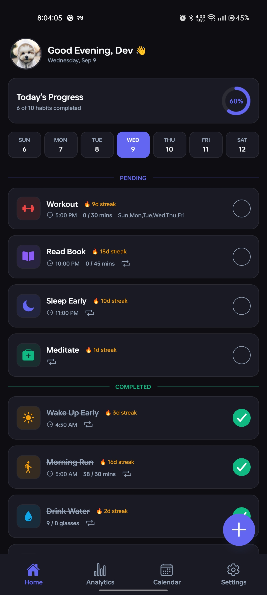 | 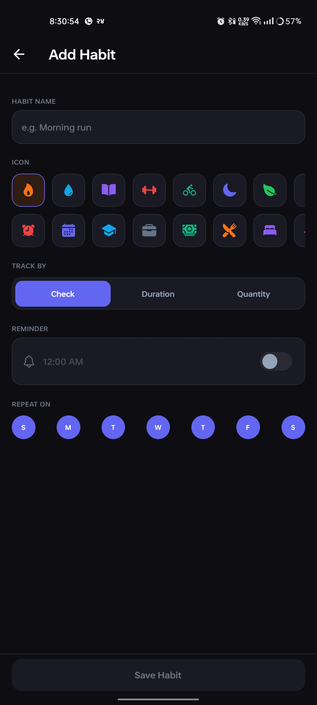 | 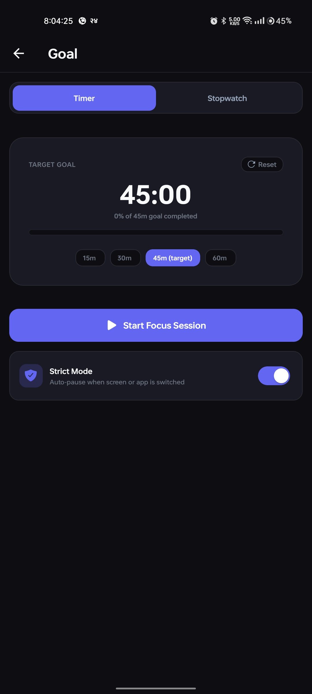 |

### 📊 Analytics & Deep Insights

|                              Habit Details & Streaks                               |                           Analytics & Completion Rates                            |                                Category & Time Breakdown                                |
| :--------------------------------------------------------------------------------: | :-------------------------------------------------------------------------------: | :-------------------------------------------------------------------------------------: |
| 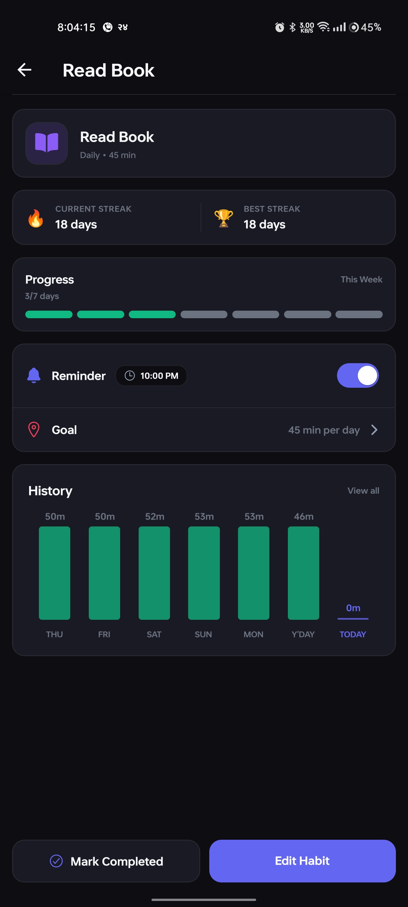 | 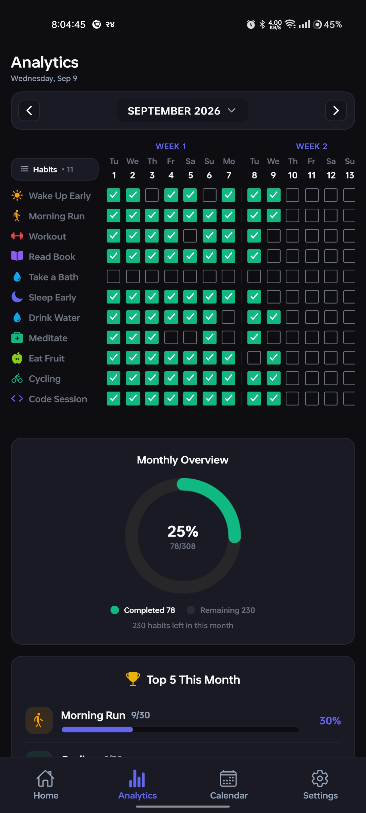 | 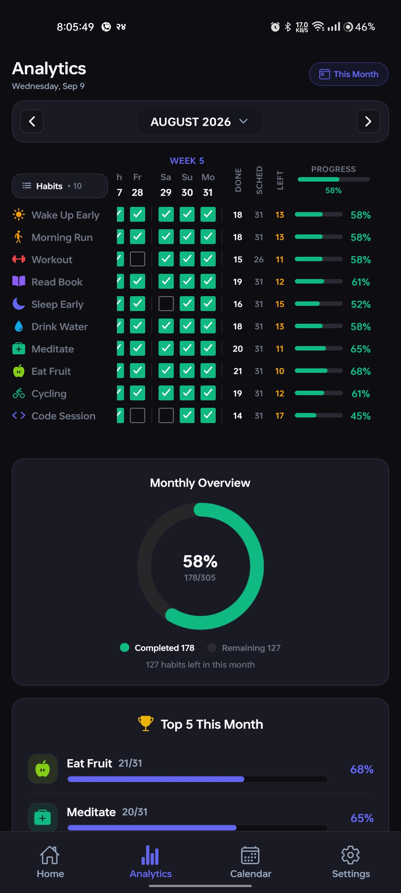 |

### 📅 Calendar History & Settings

|                               Calendar Month Heatmap                               |                                 Progress Overview                                  |                             Settings & Preferences                             |
| :--------------------------------------------------------------------------------: | :--------------------------------------------------------------------------------: | :----------------------------------------------------------------------------: |
| 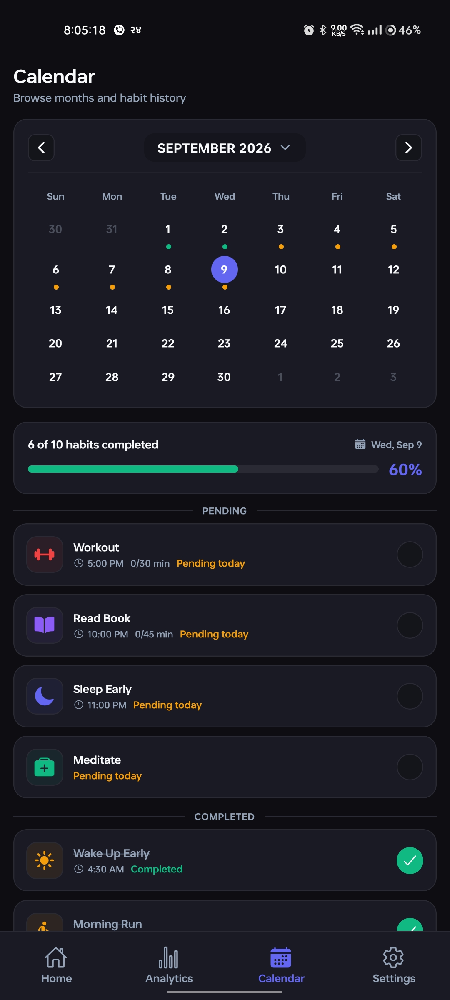 | 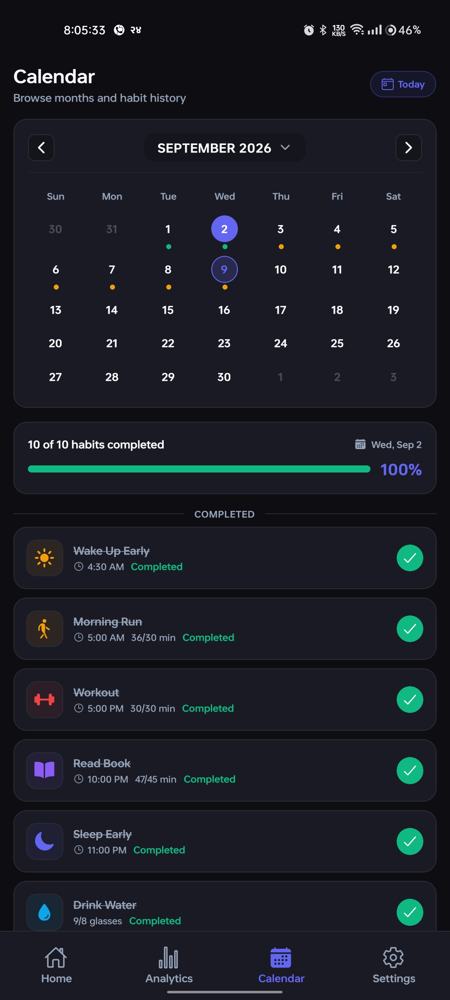 | 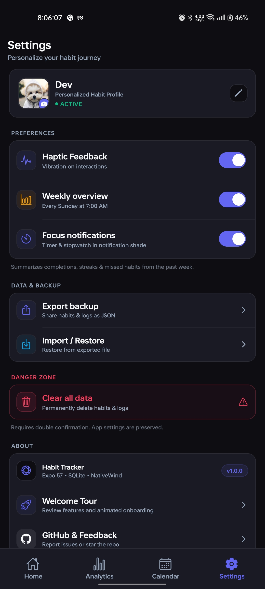 |

### 👤 Profile & Customization

|                           Profile & Avatar Customizer                           |                            Habit Configuration & Editing                            |
| :-----------------------------------------------------------------------------: | :---------------------------------------------------------------------------------: |
| 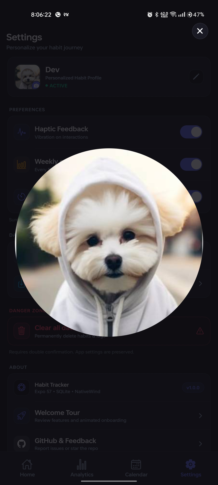 | 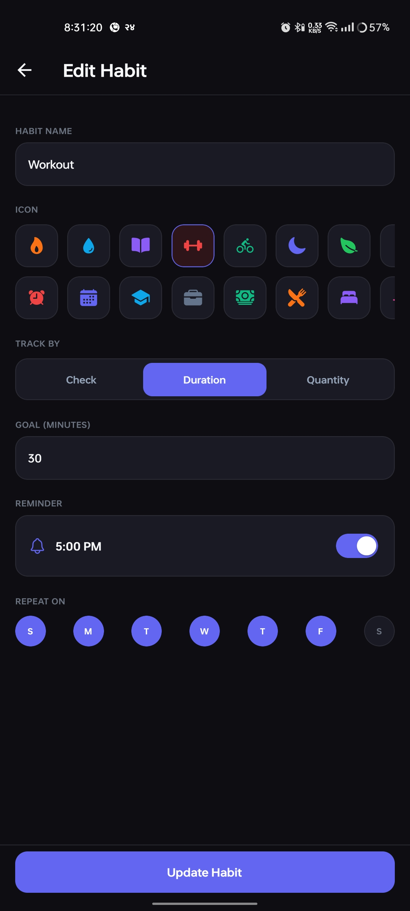 |

---

## ✨ Features

- **🎯 Flexible Habit Goals & Types**:
  - **Checkbox / Yes-No**: Simple daily completion check-ins.
  - **Duration / Time-based**: Focus sessions with countdown timer or count-up stopwatch.
  - **Quantity / Counter**: Step counters, glasses of water, pages read, with custom units.
- **⏱️ Integrated Focus & Foreground Service**:
  - Live chronometer notification in the Android notification tray using `@notifee/react-native`.
  - Pause, Resume, and Stop controls directly from notification actions.
  - Crash and reboot recovery with automatic stale session prompts.
- **📈 Rich Visual Analytics**:
  - Weekly progress bar charts and monthly pie charts.
  - Habit completion heatmaps and streak counters.
  - Top performing habits ranking.
- **📅 Interactive Calendar & History Logs**:
  - Multi-month navigation with ring progress indicators.
  - Daily audit trail of logged habits and session minutes.
- **🌙 Obsidian Neon Design**:
  - Tailored dark UI (`#0D0D12` background) with high-contrast neon accents.
  - Micro-haptic tactile feedback via `expo-haptics`.
  - Animated sheets, custom modals, and smooth spring physics with `react-native-reanimated`.
- **🔒 100% Offline & Private**:
  - Powered by local `expo-sqlite` database with WAL journal mode.
  - Profile photos stored securely in the app's local document directory.

---

## 🛠️ Tech Stack

| Technology                                                                         | Purpose                                                 |
| ---------------------------------------------------------------------------------- | ------------------------------------------------------- |
| **[Expo](https://expo.dev/)** (SDK 57)                                             | Native cross-platform application runtime               |
| **[React Native](https://reactnative.dev/)** (0.86)                                | Core mobile framework                                   |
| **[Expo Router](https://docs.expo.dev/router/introduction/)**                      | Type-safe, file-based routing architecture              |
| **[NativeWind](https://www.nativewind.dev/)** / **Tailwind CSS**                   | Utility-first responsive styling                        |
| **[expo-sqlite](https://docs.expo.dev/versions/latest/sdk/sqlite/)**               | High-performance local SQL database engine              |
| **[Zustand](https://github.com/pmndrs/zustand)**                                   | Global state management                                 |
| **[@notifee/react-native](https://notifee.app/)**                                  | Native foreground services and actionable notifications |
| **[React Native Reanimated](https://docs.swmansion.com/react-native-reanimated/)** | Fluid 60fps animations and transitions                  |
| **[@shopify/flash-list](https://shopify.github.io/flash-list/)**                   | High-performance virtualized lists                      |
| **[expo-haptics](https://docs.expo.dev/versions/latest/sdk/haptics/)**             | Physical tactile vibration feedback                     |

---

## 📁 Project Structure

```
Habit-Tracker/
├── app/                      # Expo Router navigation routes
│   ├── (tabs)/               # Tab screens: Today, Analytics, Calendar, Settings
│   ├── habit/                # Habit details and focus session routes
│   ├── addHabit.tsx          # Create & edit habit workflow
│   └── onboarding.tsx        # First-time user onboarding
├── assets/                   # App assets (icons, splash, notifications)
│   ├── AppIcon.icon/         # Liquid Glass iOS asset composer
│   └── notification-icon/    # Android density notification icons
├── components/               # Reusable UI components & modals
│   ├── Focus.tsx             # Interactive timer & stopwatch engine
│   ├── HabitCard.tsx         # Habit list item with instant completion
│   ├── RingProgressBar.tsx   # SVG ring progress visualization
│   └── ...                   # Skeletons, sheets, and confirmation dialogs
├── db/                       # SQLite schema, queries, and focus session persistence
├── services/                 # Notifee notification manager & background handlers
├── store/                    # Zustand habit, focus, and settings stores
├── plugins/                  # Custom Expo config plugins
└── screenshots/              # App preview screenshots
```

---

## 🚀 Getting Started

### Prerequisites

- [Node.js](https://nodejs.org/) (v18 or newer recommended)
- [npm](https://www.npmjs.com/) or [yarn](https://yarnpkg.com/)
- [Android Studio](https://developer.android.com/studio) or Android SDK with device/emulator connected

### Installation

1. **Clone the repository**:

   ```bash
   git clone https://github.com/mrblackhat0/Habit-Tracker.git
   cd Habit-Tracker
   ```

2. **Install dependencies**:

   ```bash
   npm install
   ```

3. **Start the development server**:

   ```bash
   npm run start
   ```

4. **Run on Android**:
   ```bash
   npm run android
   ```

---

## 🧪 Testing & Code Verification

Run static analysis, type checking, and bundle validation:

```bash
# TypeScript type checking
npx tsc --noEmit

# Linting with ESLint
npm run lint

# Generate native Android project via prebuild
npm run prebuild

# Verify production bundle export
npx expo export -p android --no-bytecode
```

---

## 📄 License

This project is licensed under the MIT License.
